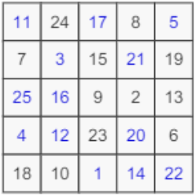

# Avenging The Fallen!

Author: Pratik Jallan

Flag: `cTf{510}`

## Problem Statement:

On the occasion of International Tug of War Day, 300 politicians Each from Congress came out to seal the deal, once and for all. To balance the team, Odd positions were occupied by people with Maximum Strength while the Even positions were occupied by people with Minimum Strength. BJP's captain was so fierce, the Congress team's captain fell and got badly injured, resulting in Red blood everywhere. With the purpose of avenging their captain, the Congress gave the opposite team a puzzle consisting of a stupid photo of their captain and told them to first recover the puzzle and then solve it. The key to the final answer is (0, 2) * (1, 3) * (3, 3) / (4, 3).

BJP almost has victory within their grasp. Can you help them solve the problem? The flag format is cTf{numerical_value_obtained}.

## Relevant files / links:

- 

## Hints:

1. The image appears to have some puzzle hidden in it, some of the uppercase letters seem to oddly stand out...
2. Shall you succeed in recovering the puzzle, all you need is a little bit of magic to solve it...

## Solution:

Suggested Difficulty: `Medium/Hard`

The problem involves `Image Steganography` and elementary `Magic Square` number theory. Steganography is a method of hiding secret data, by embedding it into some file, in this case, using an image to hide another image. It is one of the methods employed to protect secret or sensitive data from malicious attacks. A magic square is a N x N matrix, where the elements range from 1 to N * N and the sum of all the elements of every row, column and diagnol is equal.

We know that an image is nothing but a matrix of pixel intensities. As this is a coloured image, it is made up of 3 channels `(RGB)` as opposed to a grayscale one. The description gives us the hint of taking a 300 x 300 matrix in the first line. The letters Odd, Even, Maximum, Minimum, Red are all subsequent clues to recover the puzzle hidden in the image. Wherever the pixel values are `odd, take it as 255 (maximum value of a pixel)` and wherever `even, take it as 0 (minimum value of a pixel)`. This gives us a new 300 x 300 matrix which is the magic sqaure in image format.

Then one must solve the magic square manually or by using some online tool. This will give us the following answer:

- 

The final line in the problem description is a set of mathematical operations involving tuples, which is nothing but the `pair of indices` for that particular element. This gives us the answer 510. The encoding python program, solution and original images used for the same have been included.